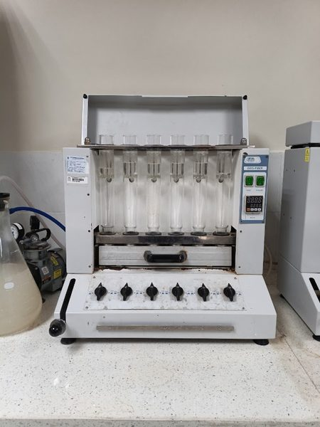
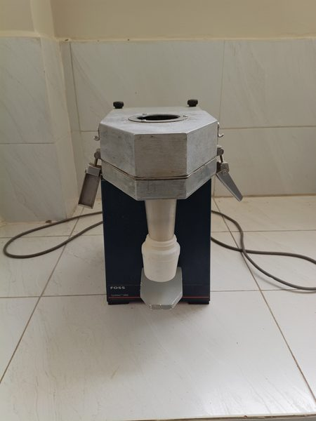
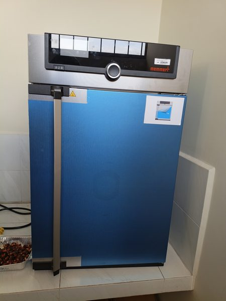
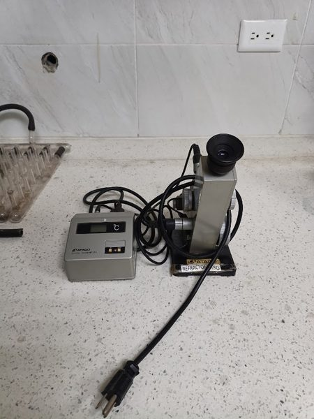
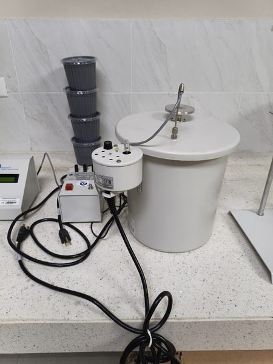
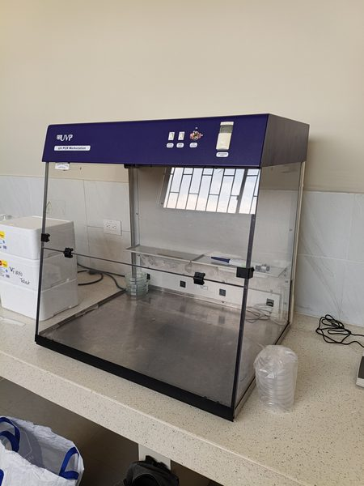
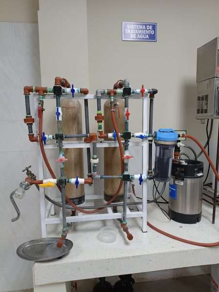
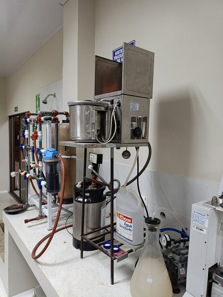
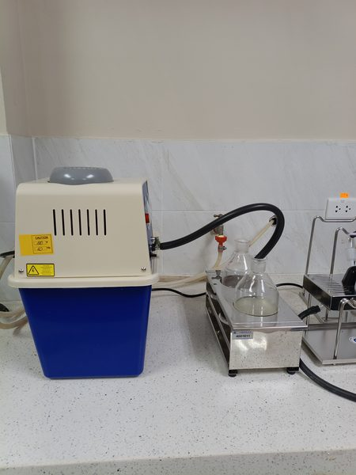
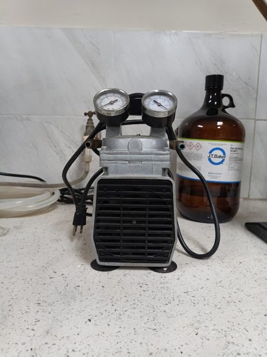

# 🔬 Catálogo Fotográfico e Inventario Completo
## Laboratorio de Bromatología - UTEQ (Equipos y Materiales Identificados)

A continuación se presentan las fotografías y especificaciones de los equipos y materiales catalogados:

---

### 1. Unidad de Destilación Kjeldahl (Proteína Cruda)
- **Marca / Modelo**: J.P. SELECTA - Pro-Nitro A (Cat. 4002430)
- **Función**: Destilación por arrastre de vapor para cuantificación de nitrógeno total y proteína bruta.
- **Norma UTEQ**: AOAC 984.13 / INEN 0516

---

### 2. Analizador de Fibra Cruda y Fracciones
- **Marca / Modelo**: J.P. SELECTA - DOSI-FIBER (Cat. 4000623)
- **Función**: Digestión y extracción de Fibra Cruda (Weende) y fracciones Van Soest (FND, FAD, Lignina).
- **Norma UTEQ**: AOAC 962.09 / ISO 6865

---

### 3. Placa Calefactora con Agitador Magnético
- **Marca / Modelo**: Heidolph MR Hei-Standard
- **Función**: Calentamiento hasta 300°C y agitación magnética homogénea hasta 1400 rpm de reactivos y disoluciones.

---

### 4. Potenciómetro / pH-metro Digital de Mesa
- **Marca / Modelo**: OHAUS STARTER 3100
- **Función**: Determinación electroquímica de pH, potencial de óxido-reducción (mV) y temperatura.
- **Norma UTEQ**: NTE INEN 0013 / AOAC 981.12

---

### 5. Molino Ciclónico de Muestras Bromatológicas
- **Marca / Modelo**: FOSS - Cyclotec 1093 Sample Mill
- **Función**: Molienda ciclónica de alta velocidad con cribas calibradas (0.5 mm y 1.0 mm) sin pérdida de humedad.
- **Norma UTEQ**: AOAC 930.15

---

### 6. Estufa / Horno Universal de Secado
- **Marca / Modelo**: Memmert UN55 / UN110
- **Función**: Deshidratación térmica a 105°C para determinación gravimétrica de materia seca y humedad total.
- **Norma UTEQ**: AOAC 930.15 / INEN 0518

---

### 7. Refractómetro Digital Abbe de Mesa
- **Marca / Modelo**: ATAGO DR-A1 (Cat. 1310)
- **Función**: Medición de índice de refracción (nD) y escala Brix (0.0 a 95.0%) en líquidos y aceites.
- **Norma UTEQ**: AOAC 932.12 / INEN 0380

---

### 8. Bomba Calorimétrica de Oxígeno
- **Marca / Modelo**: Parr 1341 Plain Jacket Calorimeter / Termómetro Parr 6775
- **Función**: Determinación del poder calorífico bruto / energía bruta (EB) en piensos y materias primas.
- **Norma UTEQ**: ISO 9831 / ASTM D5865

---

### 9. Campana de Extracción de Gases y Vapores
- **Marca / Modelo**: Labconco Protector Premier Laboratory Hood
- **Función**: Extracción y contención de vapores corrosivos (digestiones ácidas Kjeldahl, reactivos volátiles).

---

### 10. Cabina de Flujo Laminar / Trabajo Limpio UV
- **Marca / Modelo**: Analytik Jena UVP PCR Workstation
- **Función**: Área aséptica con luz UV germicida para manipulación microbiológica y preparación de muestras.

---

### 11. Batería de Desionización y Tratamiento de Agua
- **Marca / Modelo**: Sistema Desionizador con Filtro de Sedimentos y Manómetro
- **Función**: Purificación de agua para preparación de reactivos analíticos tipo II/III.

---

### 12. Destilador de Agua Metálico de Pared
- **Marca / Modelo**: Destilador Mural Acero Inoxidable (Producción ~4 L/h)
- **Función**: Producción de agua destilada de alta pureza por evaporación y condensación.

---

### 13. Bomba de Vacío por Recirculación de Agua
- **Marca / Modelo**: J.P. SELECTA (Cat. 4001611) con Manómetro
- **Función**: Generación de vacío constante para filtraciones al vacío y desecadores sin consumo excesivo de agua.

---

### 14. Bomba de Vacío Portátil de Membrana
- **Marca / Modelo**: Bomba de Diafragma con Doble Manómetro y Regulador
- **Función**: Filtración al vacío móvil para rampa de crisoles y filtración de muestras.

---

### 15. Agitador de Tubos Tipo Vortex
- **Marca / Modelo**: Boeco / Bioevopeak V-1 Plus
- **Función**: Agitación orbital rápida de tubos de ensayo y disolución de extractos.

---

### 16. Tubos de Digestión Kjeldahl y Balones de Destilación
- **Material**: Vidrio Borosilicato 3.3 en Gradilla Metálica Especial
- **Función**: Contenedores para digestión ácida a 420°C y destilación.

---

### 17. Gradilla / Soporte Giratorio para Pipetas Graduadas
- **Material**: Polipropileno autoclavable (Capacidad 94 pipetas)
- **Función**: Secado y soporte vertical ordenado de material volumétrico.

---

### 18. Piseta de Reactivo Rotulada (NaOH 0.1 N)
- **Material**: Polietileno de baja densidad (LDPE) con Rotulación SGA/GHS
- **Función**: Dosificación controlada de disoluciones valoradas y agua destilada.

---

### 19. Cilindro de Gas con Manómetro Regulador
- **Material**: Cilindro de Acero Alta Presión (200 bar) con Válvula y Manorreductor
- **Función**: Suministro de gas combustible/inerte para equipos de combustión y cromatografía.

