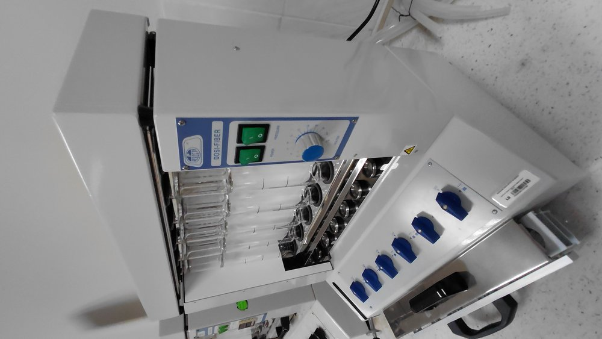
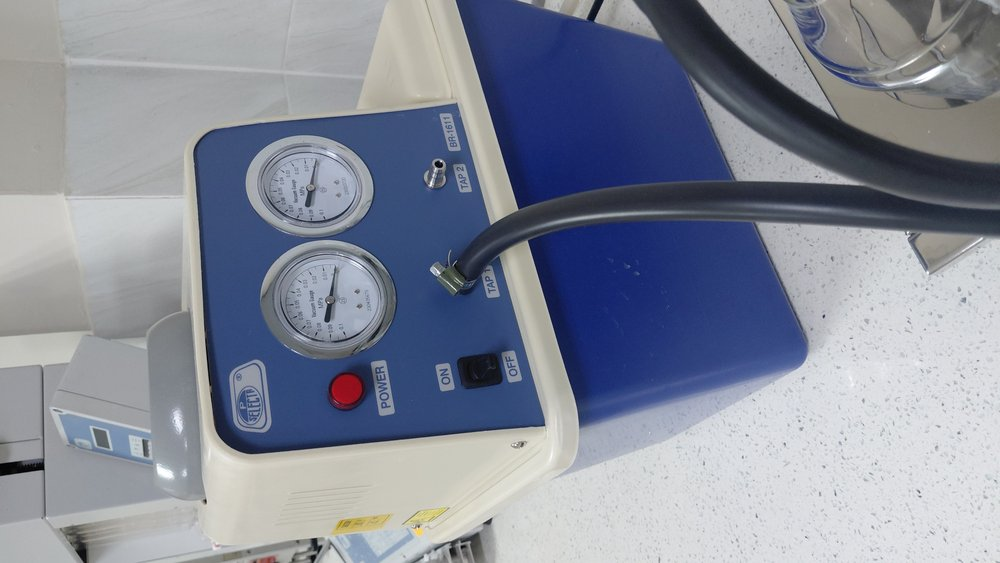
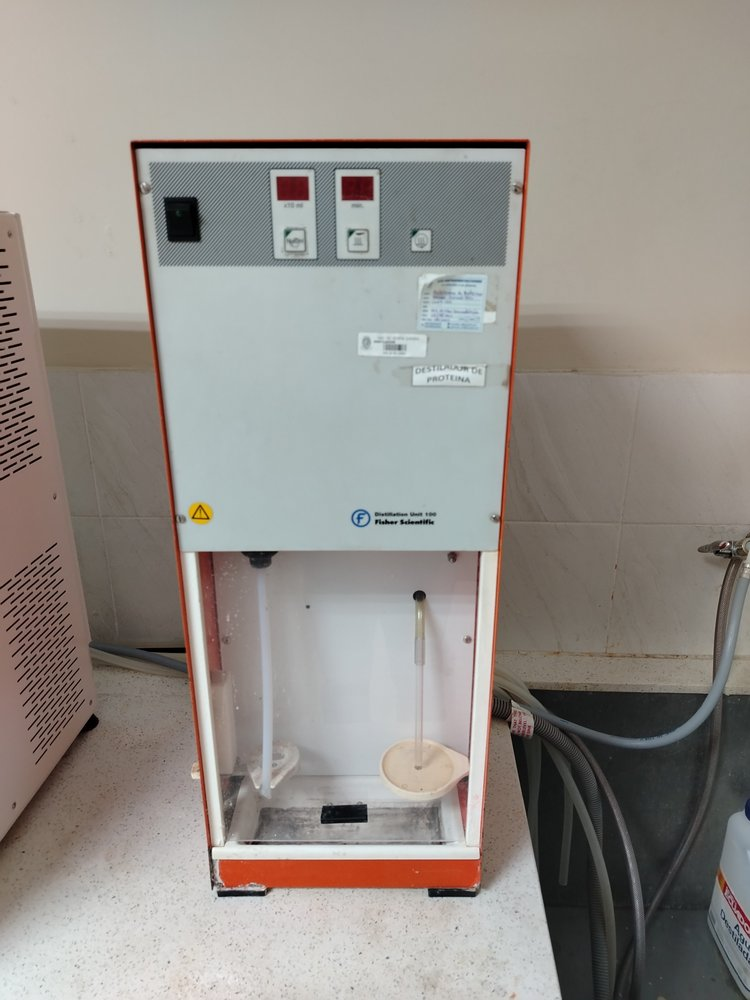
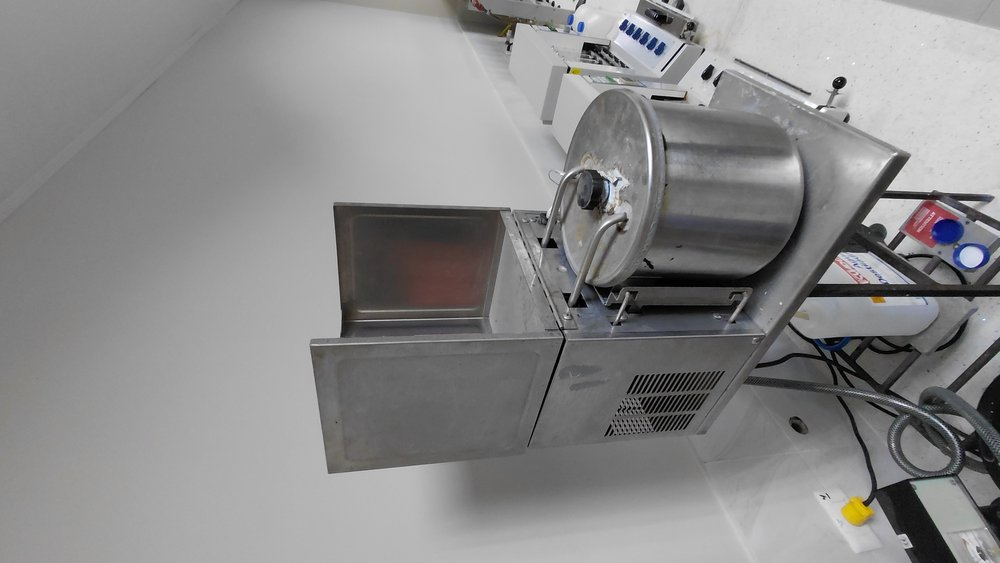
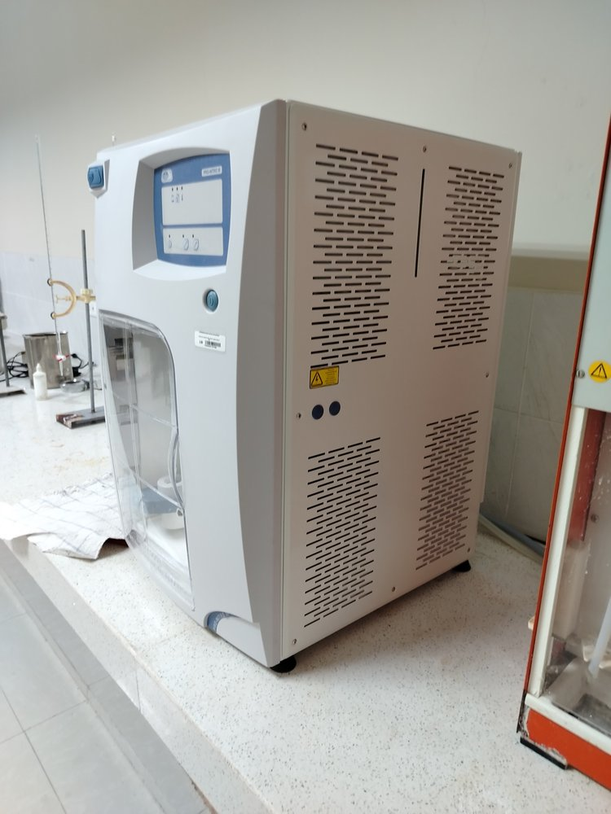
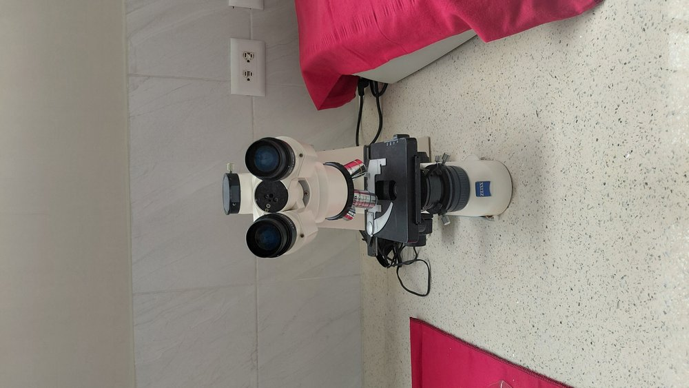
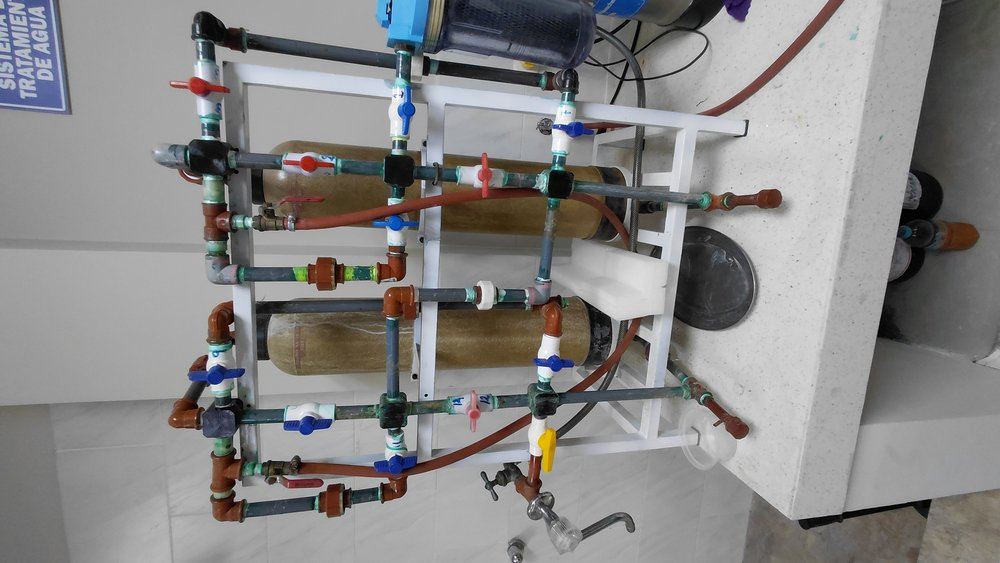
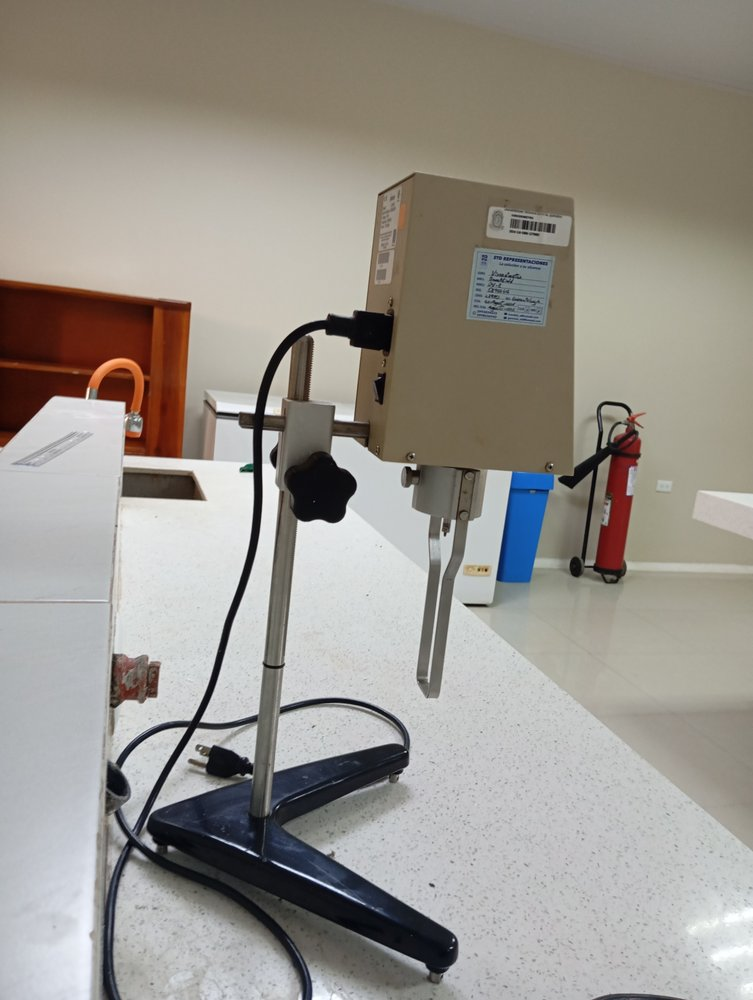

# 🔬 Catálogo Fotográfico y Fichas Técnicas Oficiales
## Laboratorio de Bromatología - UTEQ
### Equipos Seleccionados para el Asistente Inteligente de Visión Artificial y RAG

**Universidad Técnica Estatal de Quevedo (UTEQ)**  
**Facultad de Ciencias Pecuarias y Biológicas**  
*Carrera de Ingeniería en Alimentos / Zootecnia*

---

## 📋 Tabla de Equipos Seleccionados (8 Equipos Oficiales)

| ID | Etiqueta Roboflow (YOLO11) | Fabricante / Nombre Común | Modelo Oficial | Imagen |
|:--:|:---|:---|:---|:--:|
| **0** | `Analizador de Fibra Cruda y Fracciones` | J.P. SELECTA | DOSI-FIBER (Cat. 4000623) |  |
| **1** | `Bomba de Vacio por Recirculacion de Agua` | J.P. SELECTA | Bomba Recirculante (Cat. 4001611) |  |
| **2** | `Destilacion de Nitrogeno y Proteinas` | Fisher Scientific | Distillation Unit 100 (Unidad Kjeldahl) |  |
| **3** | `Destilador de Agua Continuo Metalico` | Boeco / J.P. Selecta | Destilador Mural Acero Inox 4 L/h |  |
| **4** | `Destilador por Arrastre de Vapor tipo Kjeldahl` | J.P. SELECTA | Pro-Nitro (Arrastre de Vapor) |  |
| **5** | `Microcospio Trinocular` | Carl Zeiss | ZEISS Primo Star Trinocular |  |
| **6** | `Sistema de Tratamiento y Desionizacion deAgua` | Aquapro / Genérico Industrial | Sistema Multietapa 3 Etapas con Manómetros |  |
| **7** | `Viscosimetro Brookfield Modelo DV-E` | AMETEK Brookfield | DV-E Viscometer (DVE) |  |

---

## 📑 Fichas Técnicas Detalladas

---

### 1. Sistema de Tratamiento y Desionización de Agua

- **Nombre Oficial**: Batería de Filtración, Purificación y Desionización de Agua
- **Tipo de Equipo**: Sistema de purificación por lecho mixto de resinas de intercambio iónico
- **Ubicación en Laboratorio**: Área húmeda de suministro de agua destilada y reactivos

#### Especificaciones Técnicas
- **Etapas de Filtración**:
  1. *Filtro de Sedimentos de Polipropileno Spun (5 µm)*: Remueve sólidos suspendidos, partículas de óxido, arena y turbidez.
  2. *Filtro de Carbón Activado en Bloque (CTO)*: Retención de cloro residual libre, compuestos orgánicos volátiles (COVs) y olores.
  3. *Columna Desionizadora de Lecho Mixto*: Resinas catiónicas ácidas fuertes ($H^+$) y aniónicas básicas fuertes ($OH^-$).
- **Instrumentación**: Manómetro de presión hidráulica diferencial glicerina (0 - 10 bar / 0 - 150 psi).
- **Calidad de Agua Producida**: Conductividad $< 1.0\ \mu\text{S/cm}$ (Agua Grado II / Grado III según norma ISO 3696 / ASTM D1193).
- **Caudal de Tratamiento**: 1.5 a 3.0 L/min a presión de red (2.0 - 4.0 bar).

#### Función en Bromatología
Purificación de agua potable de red para la alimentación de destiladores continuos de agua, generadores de vapor de destiladores Kjeldahl, preparación de reactivos químicos analíticos valorados (NaOH, HCl, $H_2SO_4$) y enjuague final del material de vidrio volumétrico.

#### Procedimiento Operativo Estándar
1. Abrir la válvula de paso de agua de la red principal.
2. Verificar en el manómetro que la presión de entrada esté en el rango operativo (mínimo 1.5 bar).
3. Purgar los primeros 500 mL antes de conectar la salida al tanque de almacenamiento o equipo de destilación.
4. Medir la conductividad del agua efluente con conductímetro portátil ($< 2.5\ \mu\text{S/cm}$).
5. Cerrar la válvula de corte general al finalizar la jornada de trabajo.

---

### 2. Viscosímetro Brookfield Modelo DV-E

- **Nombre Oficial**: Viscosímetro Rotacional Digital Brookfield DV-E
- **Fabricante**: AMETEK Brookfield (EE.UU.)
- **Modelo**: DV-E (Serie Digital Económica)
- **Ubicación en Laboratorio**: Mesa de reología y análisis físico de alimentos

#### Especificaciones Técnicas
- **Principio de Medición**: Resistencia al cizallamiento rotacional mediante resorte de torsión calibrado de precisión bimetálica.
- **Rango de Velocidades**: 18 velocidades fijas seleccionables (0.3, 0.5, 0.6, 1.0, 1.5, 2.0, 2.5, 3.0, 4.0, 5.0, 6.0, 10, 12, 20, 30, 50, 60, 100 RPM).
- **Precisión**: $\pm 1.0\%$ de la escala completa (Full Scale Range - FSR).
- **Repetibilidad**: $\pm 0.2\%$ de la escala completa.
- **Pantalla Digital LCD**: Muestra simultáneamente:
  - Viscosidad dinámica en centipoise (cP) o miliPascal-segundo ($mPa\cdot s$).
  - Porcentaje de torsión (% torque del resorte, rango operativo válido 10% - 100%).
  - Velocidad de rotación seleccionada (RPM).
  - Código del husillo / spindle activo (código de 2 dígitos).
- **Juego de Husillos (Spindles)**: Husillos cilíndricos de acero inoxidable AISI 316 (LV1 a LV4 para modelo LV; RV1 a RV7 para modelo RV).
- **Alimentación Eléctrica**: 115 / 230 VAC, 50/60 Hz, 30 W.

#### Función en Bromatología
Caracterización reológica y control de calidad de fluidos alimentarios newtonianos y no newtonianos: salsas, mayonesas, miel de abeja, jarabes de azúcar, pulpas de frutas, lácteos fluidos, concentrados y emulsiones cárnicas.

#### Norma de Referencia
- **NTE INEN 1009**: Miel de abeja. Determinación de viscosidad.
- **ASTM D2196**: Standard Test Methods for Rheological Properties of Non-Newtonian Materials by Rotational Viscometer.

---

### 3. Destilador de Agua Continuo Metálico

- **Nombre Oficial**: Destilador de Agua Metálico Continuo de Fijación Mural
- **Fabricante**: Boeco / J.P. SELECTA
- **Ubicación en Laboratorio**: Pared húmeda de destilación y lavado químico

#### Especificaciones Técnicas
- **Producción Nominal**: 4 Litros / hora de agua destilada continua.
- **Material de Construcción**: Caldera y refrigerante tubular íntegramente fabricados en acero inoxidable AISI 304 / 316 pulido sanitario.
- **Potencia Calefactora**: 3000 W (Resistencia eléctrica blindada de inmersión en acero inox).
- **Consumo de Agua de Refrigeración**: Aprox. 40 - 60 L/h.
- **Dispositivos de Seguridad**:
  - Termostato de corte automático por sobretemperatura en caso de corte del flujo de agua.
  - Válvula de flotador y tubo de rebose continuo para control de nivel en la caldera.
- **Calidad del Agua Destilada**: Conductividad $1.5 - 2.5\ \mu\text{S/cm}$ a 25°C, pH entre 5.5 y 7.0, exento de pirógenos e iones metálicos pesados.

#### Función en Bromatología
Abastecimiento ininterrumpido de agua destilada de alta pureza química para titulaciones cuantitativas, lavado de electrodos, ensayos microbiológicos y dilución de reactivos de digestión ácida.

---

### 4. Analizador de Fibra Cruda y Fracciones

- **Nombre Oficial**: Extractor Analizador de Fibra DOSI-FIBER
- **Fabricante**: J.P. SELECTA S.A. (España)
- **Modelo**: DOSI-FIBER (Referencia Cat. 4000623)
- **Ubicación en Laboratorio**: Mesa analítica de análisis proximal de alimentos

#### Especificaciones Técnicas
- **Capacidad de Muestreo**: 6 posiciones simultáneas e independientes con calefacción individual por posición.
- **Volumen de Reactivo**: 150 mL por muestra en columna de ebullición.
- **Control de Calefacción**: Reguladores de energía electrónicos individuales para cada una de las 6 placas calefactoras infrarrojas.
- **Sistema de Filtración**: Filtración al vacío integrada a través de crisoles de vidrio borosilicato con placa porosa filtrante de cuarzo sinterizado (porosidad P2: 40 - 100 µm).
- **Refrigerante / Condensador**: 6 refrigerantes de reflujo tipo dedo frío de acero inoxidable y vidrio para evitar pérdida de volumen por evaporación ácida o alcalina.
- **Válvulas**: Válvulas de 3 vías con posiciones: Calefacción/Digestión, Descarga a drenaje y Conexión de vacío.

#### Función en Bromatología
- Determinación gravimétrica de **Fibra Cruda** (Método oficial Weende con digestión secuencial ácida $H_2SO_4\ 0.255\text{ N}$ y alcalina $NaOH\ 0.313\text{ N}$).
- Fraccionamiento de fibras según el método de **Van Soest**:
  - Fibra Detergente Neutro (FDN - Hemicelulosa, Celulosa, Lignina).
  - Fibra Detergente Ácido (FDA - Celulosa y Lignina).
  - Lignina Detergente Ácido (LDA).

#### Norma de Referencia
- **AOAC Official Method 962.09**: Fiber (Crude) in Animal Feed and Pet Food.
- **ISO 6865**: Animal feeding stuffs - Determination of crude fibre content.

---

### 5. Bomba de Vacío por Recirculación de Agua

- **Nombre Oficial**: Bomba de Vacío por Recirculación de Agua de Doble Toma
- **Fabricante**: J.P. SELECTA S.A.
- **Modelo**: Cat. 4001611
- **Ubicación en Laboratorio**: Mesa de filtración analítica y secado al vacío

#### Especificaciones Técnicas
- **Principio de Operación**: Generación de depresión por efecto Venturi mediante bomba centrífuga interna sumergida en circuito cerrado de agua.
- **Tomas de Succión**: 2 tomas de vacío independientes con válvulas antirretorno de retención de teflón.
- **Caudal de Aspiración**: $60\ \text{L/min}$ ($3.6\ \text{m}^3/\text{h}$).
- **Vacío Límite Residual**: $20\ \text{mbar}$ (determinado por la tensión de vapor del agua a la temperatura del baño).
- **Manómetro**: Indicador de vacío analógico graduado de $0$ a $-1\ \text{bar}$ ($-760\ \text{mmHg}$).
- **Capacidad del Depósito**: 10 Litros en polipropileno químicamente resistente a vapores corrosivos.
- **Ventaja Ecológica**: Cero consumo de agua potable de red; no requiere conexión continua al grifo como las trompas de vacío convencionales.

#### Función en Bromatología
Filtración rápida de crisoles en el analizador de fibra Dosi-Fiber, filtración al vacío con embudos Büchner y matraces Kitasato, y desgasificación de solventes antes de cromatografía.

---

### 6. Microscopio Trinocular Carl Zeiss Primo Star

- **Nombre Oficial**: Microscopio Óptico Trinocular de Laboratorio Primo Star
- **Fabricante**: Carl Zeiss Microscopy GmbH (Alemania)
- **Modelo**: Primo Star Trinocular (ICS Optics)
- **Ubicación en Laboratorio**: Mesa de microbiología y microscopía analítica

#### Especificaciones Técnicas
- **Sistema Óptico**: Óptica con corrección a infinito ICS (Infinity Color-corrected System) con tratamiento antimicótico y antirreflectante integral.
- **Cabezal / Tubo**:
  - Trinocular Siedentopf con inclinación ergonómica a 30°.
  - Distribución de luz visual/fototubo: 100:0 / 0:100 (o 50:50) para acople simultáneo de cámara digital HD.
  - Distancia interpupilar regulable de 48 a 75 mm.
- **Oculares**: Gran campo WF 10x / 20 mm con ajuste dióptrico en ambos ojos.
- **Revólver Cuádruple Inclinado hacia atrás**: Equipado con 4 objetivos Plan-Acromáticos:
  1. *Plan-Achromat 4x / 0.10* (campo de observación de visión panorámica).
  2. *Plan-Achromat 10x / 0.25* (inspección de gránulos de almidón y fibras).
  3. *Plan-Achromat 40x / 0.65* retráctil (estructuras celulares de tejidos vegetales y animales).
  4. *Plan-Achromat 100x / 1.25 Oil* retráctil de inmersión en aceite (morfología bacteriana y levaduras).
- **Condensador**: Abbe centrado de apertura numérica AN 0.9 / 1.25 con diafragma iris y ranura para contraste de fases.
- **Iluminación**: LED de luz blanca con temperatura de color de 3200 K y control electrónico de intensidad luminosa con indicador óptico de barras en el estativo.
- **Platina Mecánica**: Mecánica de doble capa ($140 \times 135\ \text{mm}$) con mando coaxial X-Y bajo sin cremallera sobresaliente.

#### Función en Bromatología
- Detección de adulteraciones en harinas y almidones mediante morfología microscópica de granos.
- Identificación botánica de forrajes, materias primas y alimentos balanceados para animales.
- Control microbiológico: recuento de levaduras, mohos y frotis bacterianos en productos fermentados y lácteos.

---

### 7. Destilación por Arrastre de Vapor (J.P. Selecta Pro-Nitro)

- **Nombre Oficial**: Unidad Automática de Destilación por Arrastre de Vapor Pro-Nitro
- **Fabricante**: J.P. SELECTA S.A.
- **Modelo**: Pro-Nitro (Generador de Vapor Autónomo)
- **Ubicación en Laboratorio**: Mesa de destilación y enriquecimiento de extractos

#### Especificaciones Técnicas
- **Generador de Vapor**: Generador de vapor continuo de acero inoxidable con control de nivel por electrodos y termostato de sobrepresión.
- **Tiempo de Destilación**: Programable digitalmente de 1 a 60 minutos con resolución de 1 segundo.
- **Capacidad de Muestra**: Adaptadores universales para tubos de macro-digestión ($\varnothing 42\ \text{mm}$) y matraces de 250 / 500 mL.
- **Consumo de Agua en Refrigerante**: $1.5 - 2.0\ \text{L/min}$ a 15°C.
- **Seguridades Integradas**:
  - Puerta de policarbonato transparente con microinterruptor magnético de bloqueo de ciclo.
  - Sensor de presencia de tubo de muestra (impide la inyección de vapor si el tubo no está colocado).
  - Alarma visual y acústica de falta de agua de alimentación.

#### Función en Bromatología
Extracción y separación de compuestos orgánicos volátiles, determinación de alcohol en bebidas fermentadas, acidez volátil en vinos y vinagres, y separación por vapor de extractos vegetales.

---

### 8. Destilador de Proteína (Fisher Scientific Distillation Unit 100)

- **Nombre Oficial**: Unidad de Destilación Kjeldahl para Proteína Bruta
- **Fabricante**: Fisher Scientific / Labconco
- **Modelo**: Distillation Unit 100
- **Ubicación en Laboratorio**: Mesa analítica de nitrógeno y proteína total

#### Especificaciones Técnicas
- **Método Químico**: Destilación Kjeldahl por arrastre de vapor de macro-muestras digeridas alcalinizadas.
- **Panel de Control Frontal**:
  - *Dosificador de Hidróxido de Sodio (NaOH 40%)*: Selector digital programable con escala $x10\ \text{mL}$ con bomba de membrana dosificadora de alta precisión resistente a bases fuertes.
  - *Temporizador de Destilación*: Pantalla digital LED en minutos con parada automática y señal acústica de fin de destilación.
  - *Pulsador de Vapor Rápido*: Inyección suplementaria de vapor.
- **Rango de Recuperación de Nitrógeno**: $\ge 99.5\%$ en soluciones estándar de sulfato de amonio.
- **Límite de Detección**: $0.1\ \text{mg de Nitrógeno}$.
- **Refrigerante**: Serpentín condensador de vidrio borosilicato 3.3 con descarga directa sobre el matraz receptor de ácido bórico ($H_3BO_3\ 4\%$) con indicador mixto Tashiro.

#### Función en Bromatología
Determinación cuantitativa de **Proteína Bruta / Proteína Cruda (PB)** en harinas de pescado, soya, granos de cereales, forrajes secos, concentrados y alimentos procesados mediante la reacción:
$$\%PB = \%N_{\text{total}} \times 6.25\quad (\text{o factor específico según matriz})$$

#### Norma de Referencia
- **AOAC Official Method 984.13**: Protein (Crude) in Animal Feed and Pet Food (Copper Catalyst Kjeldahl Method).
- **NTE INEN 0516**: Alimentos para animales. Determinación de nitrógeno y cálculo de proteína cruda.

---

*Catálogo oficial del proyecto **Asistente Inteligente de Laboratorio con Visión Artificial y RAG** — Universidad Técnica Estatal de Quevedo (UTEQ 2026).*  
*Equipos documentados y verificados físicamente en el Laboratorio de Bromatología.*
