# 🔬 Catálogo Fotográfico e Inventario de Equipos y Materiales
## Laboratorio de Bromatología - UTEQ
### Dataset Oficial de Detección con Visión Artificial (26 Clases YOLO11)

**Universidad Técnica Estatal de Quevedo (UTEQ)**  
**Facultad de Ciencias Pecuarias y Biológicas**  
*Proyecto: Asistente Inteligente de Laboratorio con Visión Artificial y RAG*

---

### Tabla de Clases del Modelo YOLO11

| ID Clase | Nombre de Clase en Entrenamiento (labels.txt) | Equipo / Material Representado | Fotografía |
|:---:|:---|:---|:---:|
| **0** | `Agitador de Tubos - Mezclador Vortex` | Agitador Vortex Boeco V-1 Plus | [Ver foto](#clase-0-agitador-de-tubos---mezclador-vortex) |
| **1** | `Agua Destilada Desmineralizada` | Piseta / Envase de Agua Destilada | [Ver foto](#clase-1-agua-destilada-desmineralizada) |
| **2** | `Analizador de Fibra Cruda y Fracciones` | Analizador Dosi-Fiber J.P. Selecta | [Ver foto](#clase-2-analizador-de-fibra-cruda-y-fracciones) |
| **3** | `Balanza Analitica de la Serie Ohaus Pioneer` | Balanza Analítica Ohaus Pioneer PX224 | [Ver foto](#clase-3-balanza-analitica-de-la-serie-ohaus-pioneer) |
| **4** | `Bateria de Desionizacion y Tratamiento de Agua` | Batería Desionizadora con Manómetros | [Ver foto](#clase-4-bateria-de-desionizacion-y-tratamiento-de-agua) |
| **5** | `Bomba Calorimetrica de Oxigeno` | Bomba Calorimétrica Parr 1341 | [Ver foto](#clase-5-bomba-calorimetrica-de-oxigeno) |
| **6** | `Bomba de Vacio de Membrana - Diafragma Portatil` | Bomba de Vacío de Membrana Portátil | [Ver foto](#clase-6-bomba-de-vacio-de-membrana---diafragma-portatil) |
| **7** | `Bomba de Vacio por Recirculacion de Agua` | Bomba de Vacío por Recirculación Selecta | [Ver foto](#clase-7-bomba-de-vacio-por-recirculacion-de-agua) |
| **8** | `Cabina de Flujo Laminar` | Cabina de Flujo Aséptico UVP Workstation | [Ver foto](#clase-8-cabina-de-flujo-laminar) |
| **9** | `Campana de Extraccion de Gases de Laboratorio` | Campana de Gases Labconco Protector | [Ver foto](#clase-9-campana-de-extraccion-de-gases-de-laboratorio) |
| **10** | `Destilacion por Arrastre de Vapor` | Sistema de Destilación por Arrastre | [Ver foto](#clase-10-destilacion-por-arrastre-de-vapor) |
| **11** | `Destilador por Arrastre de Vapor tipo Kjeldahl` | Destilador por Arrastre Kjeldahl | [Ver foto](#clase-11-destilador-por-arrastre-de-vapor-tipo-kjeldahl) |
| **12** | `Destilador_de_Agua_Continuo_Metalico` | Destilador Mural Acero Inoxidable | [Ver foto](#clase-12-destilador_de_agua_continuo_metalico) |
| **13** | `Estufa - Horno Universal de Secado` | Horno / Estufa de Secado Memmert | [Ver foto](#clase-13-estufa---horno-universal-de-secado) |
| **14** | `Extractor de Laboratorio Automatico para Analisis de Grasas y Aceites` | Extractor de Grasas Soxhlet Automático | [Ver foto](#clase-14-extractor-de-laboratorio-automatico-para-analisis-de-grasas-y-aceites) |
| **15** | `Molino Ciclonico de Muestras Bromatologicas` | Molino Ciclónico FOSS Cyclotec 1093 | [Ver foto](#clase-15-molino-ciclonico-de-muestras-bromatologicas) |
| **16** | `Mufla Electrica de Laboratorio` | Horno Mufla para Calcinación 550°C | [Ver foto](#clase-16-mufla-electrica-de-laboratorio) |
| **17** | `Placa Calefactora con Agitador MagneticoMetalico` | Placa Calefactora Agitadora Heidolph | [Ver foto](#clase-17-placa-calefactora-con-agitador-magneticometalico) |
| **18** | `Potenciometro - pH-metro Digital de Mesa` | pH-metro Digital OHAUS Starter 3100 | [Ver foto](#clase-18-potenciometro---ph-metro-digital-de-mesa) |
| **19** | `Refractometro Digital Abbe de Mesa` | Refractómetro Digital ATAGO DR-A1 | [Ver foto](#clase-19-refractometro-digital-abbe-de-mesa) |
| **20** | `Sistema de Tratamiento y Desionizacion deAgua` | Sistema Multietapa de Purificación | [Ver foto](#clase-20-sistema-de-tratamiento-y-desionizacion-deagua) |
| **21** | `Soporte Giratorio para Pipetas de Vidrio` | Gradilla / Soporte Rotatorio Pipetas | [Ver foto](#clase-21-soporte-giratorio-para-pipetas-de-vidrio) |
| **22** | `Stufa de Laboratorio de Conveccion` | Estufa de Convección de Laboratorio | [Ver foto](#clase-22-stufa-de-laboratorio-de-conveccion) |
| **23** | `Termometro Digital Parr Model 6775` | Termómetro Digital de Alta Precisión Parr | [Ver foto](#clase-23-termometro-digital-parr-model-6775) |
| **24** | `Unidad de Destilacion Kjeldahl` | Unidad Pro-Nitro A para Proteína | [Ver foto](#clase-24-unidad-de-destilacion-kjeldahl) |
| **25** | `Viscosimetro Rotacional Digital Brookfield` | Viscosímetro Digital AMETEK Brookfield | [Ver foto](#clase-25-viscosimetro-rotacional-digital-brookfield) |

---

## Fichas Técnicas con Fotografía Exclusiva por Clase

### Clase 0: Agitador de Tubos - Mezclador Vortex
- **Nombre en Entrenamiento**: `Agitador de Tubos - Mezclador Vortex`
- **Marca / Modelo**: Boeco / Bioevopeak V-1 Plus
- **Función**: Agitación orbital de alta velocidad de tubos de ensayo y microtubos para disolución rápida y homogenización de precipitados y extractos.

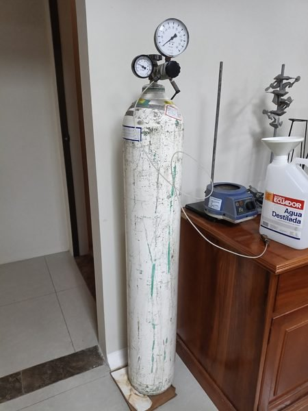

---

### Clase 1: Agua Destilada Desmineralizada
- **Nombre en Entrenamiento**: `Agua Destilada Desmineralizada`
- **Elemento**: Piseta / Recipiente Dosificador de Agua Destilada Tipo II/III
- **Función**: Almacenamiento y dosificación controlada de agua desmineralizada libre de interferencias iónicas para lavado de electrodos, enjuague de material volumétrico y preparación de soluciones valoradas.

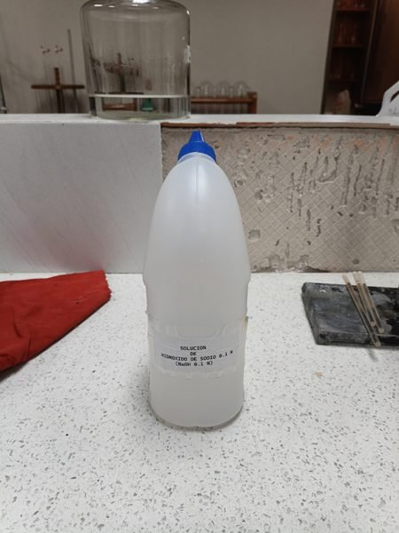

---

### Clase 2: Analizador de Fibra Cruda y Fracciones
- **Nombre en Entrenamiento**: `Analizador de Fibra Cruda y Fracciones`
- **Marca / Modelo**: J.P. SELECTA - DOSI-FIBER (Cat. 4000623)
- **Función**: Digestión ácida y alcalina en caliente y filtración integrada para la determinación de Fibra Cruda (método Weende) y fracciones insolubles Van Soest (FND, FAD, Lignina) en forrajes y alimentos balanceados.
- **Norma UTEQ**: AOAC 962.09 / ISO 6865

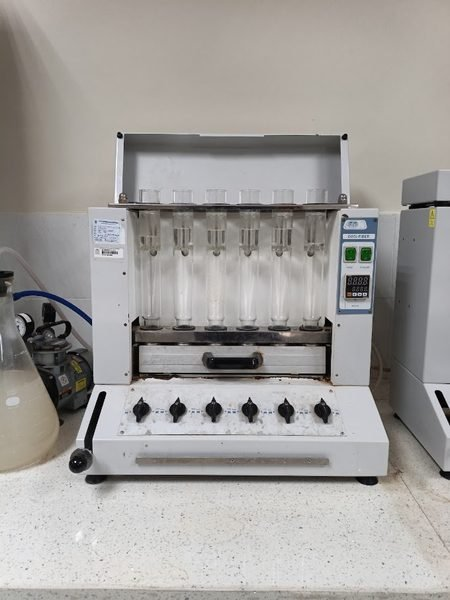

---

### Clase 3: Balanza Analitica de la Serie Ohaus Pioneer
- **Nombre en Entrenamiento**: `Balanza Analitica de la Serie Ohaus Pioneer`
- **Marca / Modelo**: OHAUS Corporation - Serie Pioneer PX224 / PX124
- **Función**: Determinación gravimétrica analítica con precisión de 0.1 mg (0.0001 g) para pesaje de crisoles, dedales de extracción, reactivos analíticos y muestras desecadas.
- **Norma UTEQ**: AOAC 930.15 / AOAC 942.05

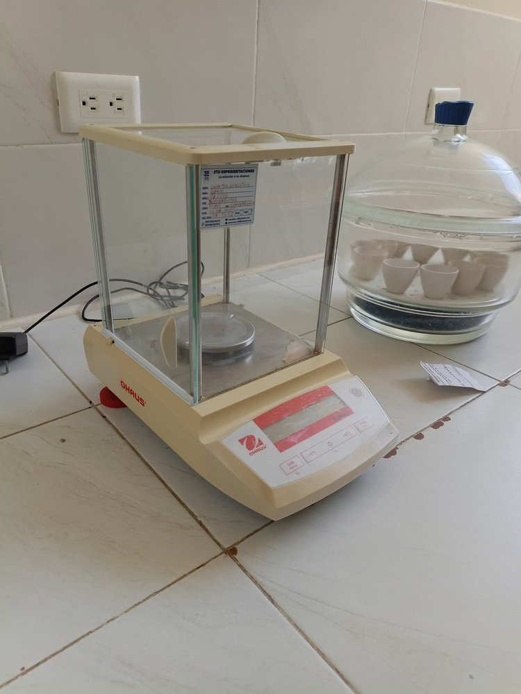

---

### Clase 4: Bateria de Desionizacion y Tratamiento de Agua
- **Nombre en Entrenamiento**: `Bateria de Desionizacion y Tratamiento de Agua`
- **Marca / Modelo**: Sistema Desionizador de Lecho Mixto con Filtro de Sedimentos y Manómetros
- **Función**: Reducción de conductividad y remoción de sales minerales del agua de red mediante intercambio catiónico/aniónico para suministro a equipos de destilación.

---

### Clase 5: Bomba Calorimetrica de Oxigeno
- **Nombre en Entrenamiento**: `Bomba Calorimetrica de Oxigeno`
- **Marca / Modelo**: Parr 1341 Plain Jacket Oxygen Bomb Calorimeter
- **Función**: Determinación experimental del poder calorífico bruto / energía bruta (EB en kcal/kg o MJ/kg) mediante combustión completa a 30 atm de O₂ de raciones alimenticias y forrajes.
- **Norma UTEQ**: ISO 9831 / ASTM D5865

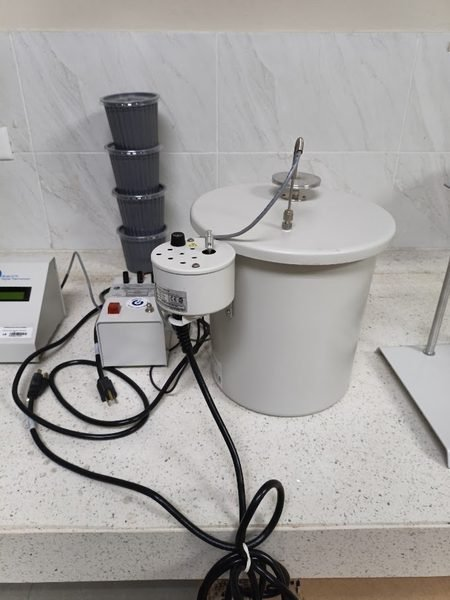

---

### Clase 6: Bomba de Vacio de Membrana - Diafragma Portatil
- **Nombre en Entrenamiento**: `Bomba de Vacio de Membrana - Diafragma Portatil`
- **Marca / Modelo**: Bomba de Vacío Libre de Aceite con Manómetro y Válvula de Regulación
- **Función**: Generación de presión negativa limpia y seca para filtración de crisoles en análisis de fibra, secado en desecadores y filtración en línea de solventes.

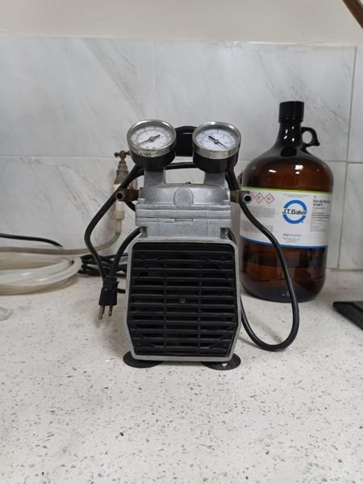

---

### Clase 7: Bomba de Vacio por Recirculacion de Agua
- **Nombre en Entrenamiento**: `Bomba de Vacio por Recirculacion de Agua`
- **Marca / Modelo**: J.P. SELECTA (Cat. 4001611) con Tanque de Reserva y Doble Manómetro
- **Función**: Succión continua por efecto Venturi mediante recirculación interna de agua en circuito cerrado, reduciendo a cero el desperdicio hídrico en filtraciones al vacío prolongadas.

---

### Clase 8: Cabina de Flujo Laminar
- **Nombre en Entrenamiento**: `Cabina de Flujo Laminar`
- **Marca / Modelo**: Analytik Jena UVP PCR Workstation
- **Función**: Creación de un recinto aséptico con iluminación germicida ultravioleta (UV-C 254 nm) para preparación de reactivos biológicos, inoculaciones y protección contra contaminantes aéreos.

---

### Clase 9: Campana de Extraccion de Gases de Laboratorio
- **Nombre en Entrenamiento**: `Campana de Extraccion de Gases de Laboratorio`
- **Marca / Modelo**: Labconco Protector Premier Laboratory Fume Hood
- **Función**: Evacuación forzada y neutralización de vapores ácidos de digestión (SO₃, H₂SO₄) y solventes orgánicos volátiles, protegiendo al personal técnico de inhalaciones tóxicas.

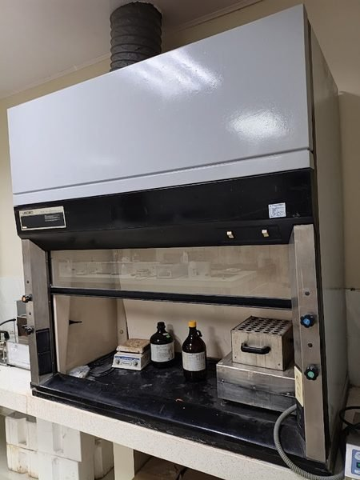

---

### Clase 10: Destilacion por Arrastre de Vapor
- **Nombre en Entrenamiento**: `Destilacion por Arrastre de Vapor`
- **Equipo**: Sistema de Arrastre de Vapor para Separación de Compuestos
- **Función**: Inyección de vapor saturado en reactores de vidrio para arrastrar y separar analitos termo-sensibles o con elevado punto de ebullición presentes en matrices bromatológicas digeridas.

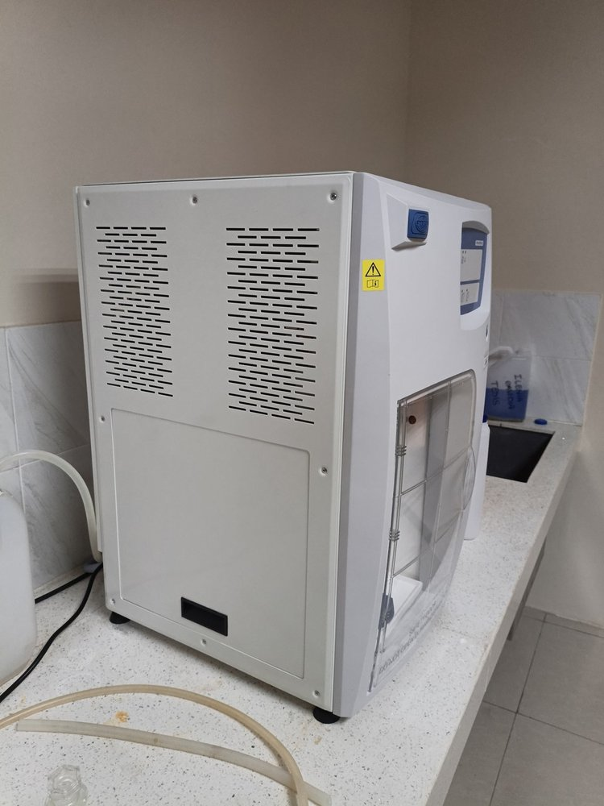

---

### Clase 11: Destilador por Arrastre de Vapor tipo Kjeldahl
- **Nombre en Entrenamiento**: `Destilador por Arrastre de Vapor tipo Kjeldahl`
- **Marca / Modelo**: J.P. SELECTA - Pro-Nitro A (Módulo Destilador)
- **Función**: Dosificación automática de NaOH concentrado sobre macro-tubos Kjeldahl y destilación directa del amoníaco volatilizado hacia un refrigerante para titulación cuantitativa.
- **Norma UTEQ**: AOAC 984.13 / INEN 0516

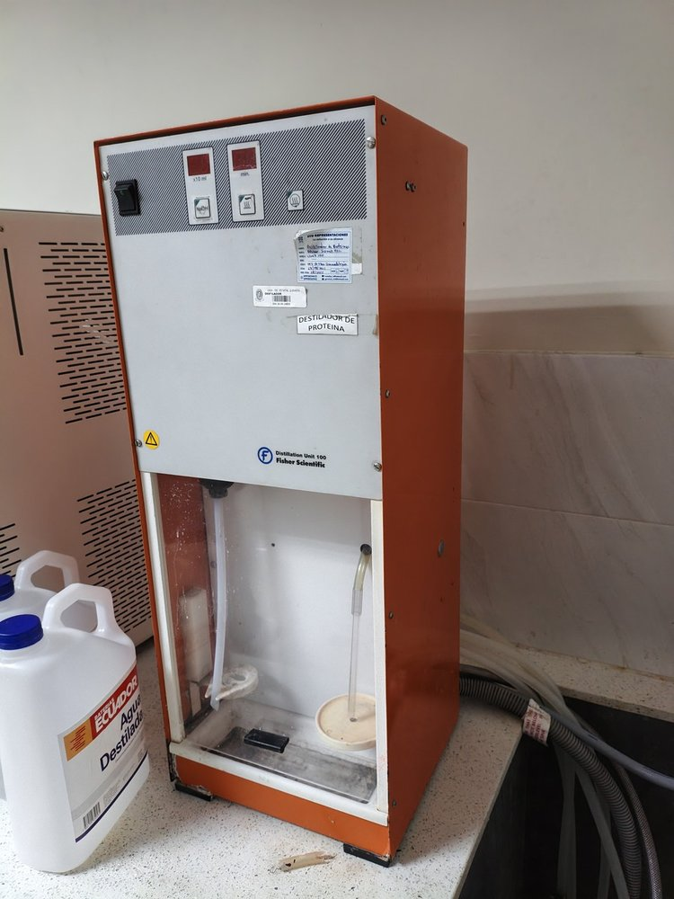

---

### Clase 12: Destilador_de_Agua_Continuo_Metalico
- **Nombre en Entrenamiento**: `Destilador_de_Agua_Continuo_Metalico`
- **Marca / Modelo**: Destilador Mural de Acero Inoxidable (Capacidad: 4 L/h)
- **Función**: Producción continua de agua destilada de alta pureza química mediante calentamiento eléctrico por resistencias blindadas y posterior condensación tubular en acero inox.

---

### Clase 13: Estufa - Horno Universal de Secado
- **Nombre en Entrenamiento**: `Estufa - Horno Universal de Secado`
- **Marca / Modelo**: Memmert UN55 / UN110
- **Función**: Evaporación y deshidratación térmica controlada a 105°C ± 1°C para la determinación gravimétrica de materia seca, humedad total y secado de crisoles a peso constante.
- **Norma UTEQ**: AOAC 930.15 / INEN 0518

---

### Clase 14: Extractor de Laboratorio Automatico para Analisis de Grasas y Aceites
- **Nombre en Entrenamiento**: `Extractor de Laboratorio Automatico para Analisis de Grasas y Aceites`
- **Marca / Modelo**: VELP Scientifica SER 148 / ANKOM Technology
- **Función**: Extracción automática de extracto etéreo (grasa cruda) en alimentos mediante lavado con solvente orgánico (éter de petróleo / hexano), reflujo, recuperación de solvente y secado gravimétrico.
- **Norma UTEQ**: AOAC 920.39 / INEN 0523

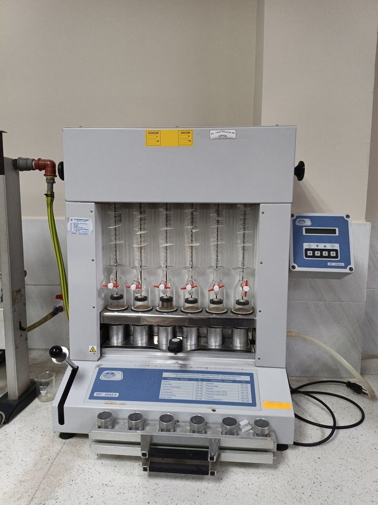

---

### Clase 15: Molino Ciclonico de Muestras Bromatologicas
- **Nombre en Entrenamiento**: `Molino Ciclonico de Muestras Bromatologicas`
- **Marca / Modelo**: FOSS - Cyclotec 1093 Sample Mill
- **Función**: Molienda por impacto de alta velocidad con flujo de aire ciclónico que impulsa la muestra a través de una criba de 1.0 mm o 0.5 mm, garantizando uniformidad granulométrica sin pérdida de humedad por fricción.
- **Norma UTEQ**: AOAC 930.15

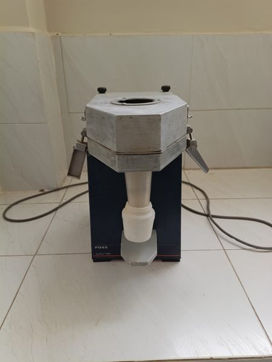

---

### Clase 16: Mufla Electrica de Laboratorio
- **Nombre en Entrenamiento**: `Mufla Electrica de Laboratorio`
- **Marca / Modelo**: Thermo Scientific Thermolyne F48000 / Nabertherm
- **Función**: Incineración y calcinación térmica de muestras orgánicas entre 550°C y 600°C en crisoles de porcelana para la cuantificación del residuo inorgánico (cenizas totales y minerales).
- **Norma UTEQ**: AOAC 942.05 / INEN 0401

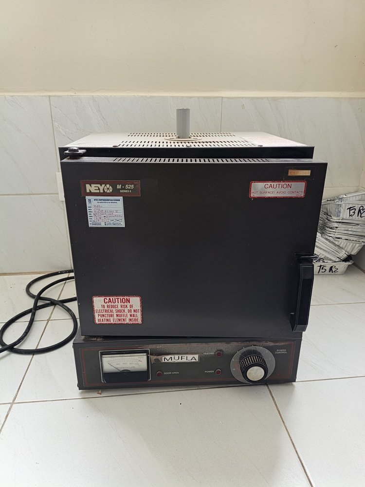

---

### Clase 17: Placa Calefactora con Agitador MagneticoMetalico
- **Nombre en Entrenamiento**: `Placa Calefactora con Agitador MagneticoMetalico`
- **Marca / Modelo**: Heidolph MR Hei-Standard
- **Función**: Calentamiento de soluciones analíticas hasta 300°C con agitación magnética controlada por imán rotatorio de 100 a 1400 rpm para disolución de sales y preparación de reactivos.

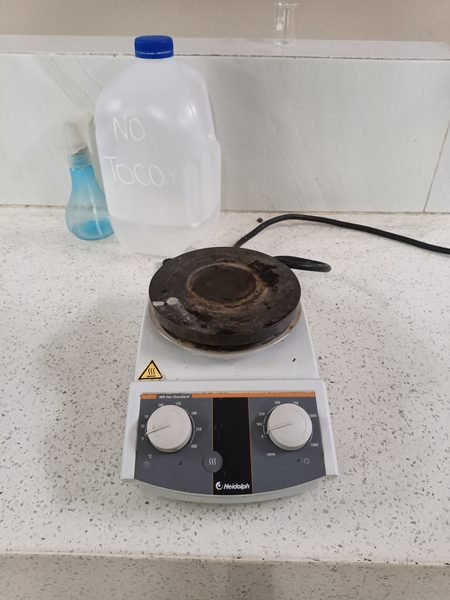

---

### Clase 18: Potenciometro - pH-metro Digital de Mesa
- **Nombre en Entrenamiento**: `Potenciometro - pH-metro Digital de Mesa`
- **Marca / Modelo**: OHAUS STARTER 3100
- **Función**: Cuantificación potenciométrica del pH con compensación automática de temperatura (ATC) y lectura de potencial redox en mV en soluciones, jugos, ensilajes y extractos.
- **Norma UTEQ**: NTE INEN 0013 / AOAC 981.12

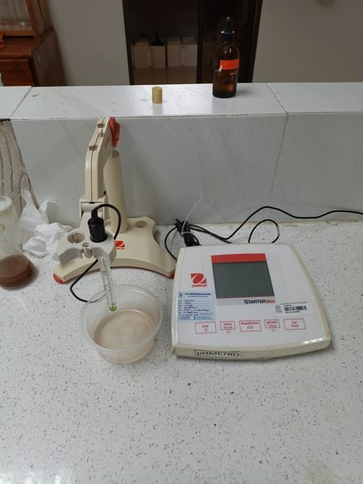

---

### Clase 19: Refractometro Digital Abbe de Mesa
- **Nombre en Entrenamiento**: `Refractometro Digital Abbe de Mesa`
- **Marca / Modelo**: ATAGO DR-A1 (Cat. 1310)
- **Función**: Medición precisa del índice de refracción (nD) y concentración de sólidos solubles (°Brix entre 0.0% y 95.0%) en jarabes, mieles, aceites y grasas fundidas con control de temperatura.
- **Norma UTEQ**: AOAC 932.12 / INEN 0380

---

### Clase 20: Sistema de Tratamiento y Desionizacion deAgua
- **Nombre en Entrenamiento**: `Sistema de Tratamiento y Desionizacion deAgua`
- **Equipo**: Módulo Filtrante y Columnas de Desionización de Agua
- **Función**: Pre-tratamiento de agua potable mediante filtración de sedimentos de 5 micras, decloración por carbón activado y desionización por resinas catiónicas y aniónicas regenerables.

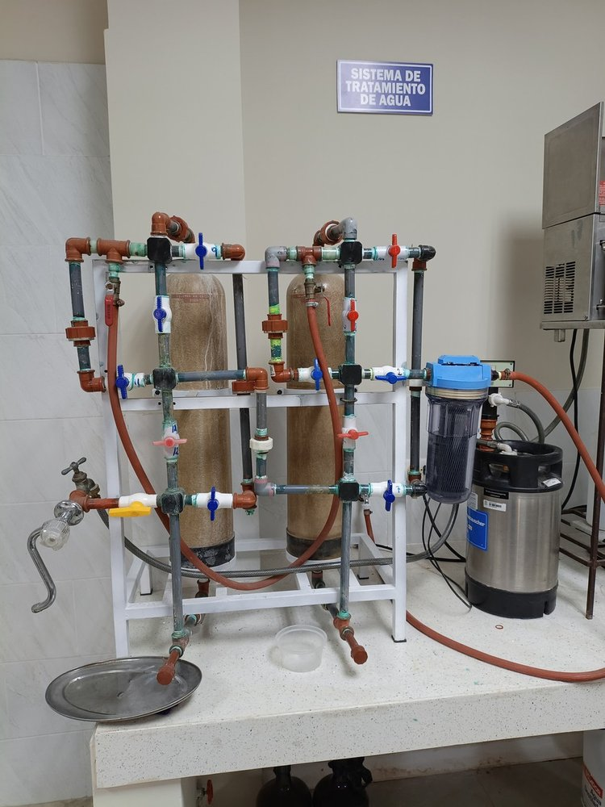

---

### Clase 21: Soporte Giratorio para Pipetas de Vidrio
- **Nombre en Entrenamiento**: `Soporte Giratorio para Pipetas de Vidrio`
- **Material**: Polipropileno autoclavable de alta resistencia (Capacidad: hasta 94 pipetas)
- **Función**: Soporte vertical carrusel giratorio para escurrimiento, secado y almacenamiento higiénico de pipetas volumétricas y graduadas de vidrio.

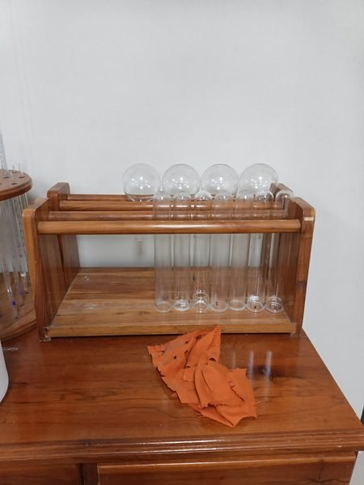

---

### Clase 22: Stufa de Laboratorio de Conveccion
- **Nombre en Entrenamiento**: `Stufa de Laboratorio de Conveccion`
- **Marca / Modelo**: Estufa de Secado y Convección Forzada de Aire
- **Función**: Secado y calentamiento uniforme de material de cristalería, crisoles de Gooch y muestras analíticas con flujo de aire térmico circulante continuo.

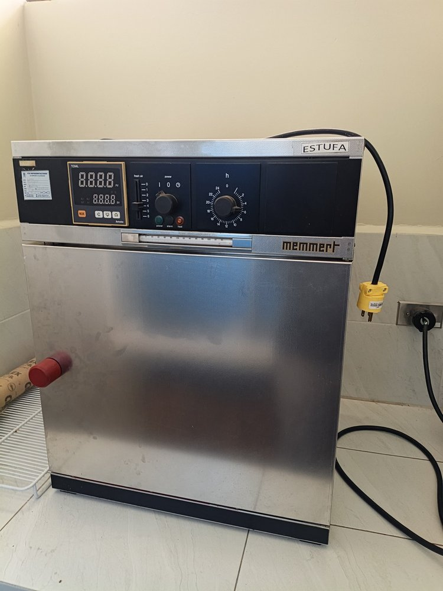

---

### Clase 23: Termometro Digital Parr Model 6775
- **Nombre en Entrenamiento**: `Termometro Digital Parr Model 6775`
- **Marca / Modelo**: Parr Instrument Company - Model 6775 Digital Thermometer
- **Función**: Medición termométrica de resolución microclimática (0.0001°C) para registrar la elevación exacta de temperatura de la cubeta durante la ignición calorimétrica de bombas de oxígeno.

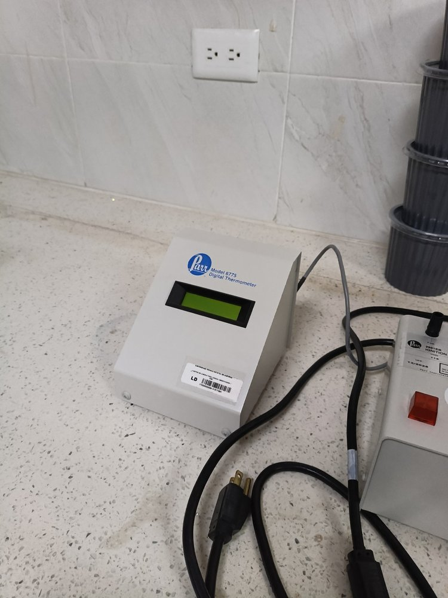

---

### Clase 24: Unidad de Destilacion Kjeldahl
- **Nombre en Entrenamiento**: `Unidad de Destilacion Kjeldahl`
- **Marca / Modelo**: J.P. SELECTA - Pro-Nitro A (Cat. 4002430)
- **Función**: Unidad integral y programable de destilación por vapor para la recuperación cuantitativa de nitrógeno amoniacal en la determinación de Proteína Bruta (PB = %N × 6.25).
- **Norma UTEQ**: AOAC 984.13 / INEN 0516

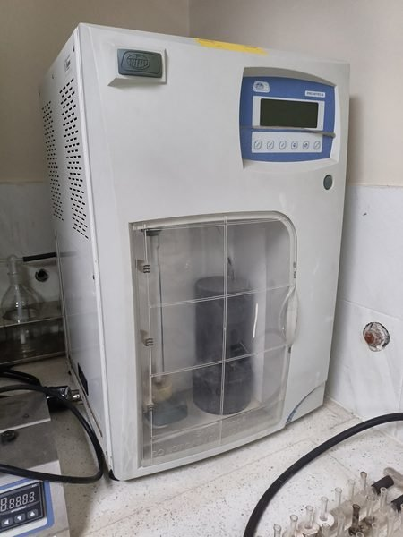

---

### Clase 25: Viscosimetro Rotacional Digital Brookfield
- **Nombre en Entrenamiento**: `Viscosimetro Rotacional Digital Brookfield`
- **Marca / Modelo**: AMETEK Brookfield - DV-II+ Pro / DV2T
- **Función**: Medición de la resistencia reológica al cizallamiento y determinación de la viscosidad aparente (cP / mPa·s) en emulsiones, salsas, lácteos, mieles y suspensiones bromatológicas mediante husillos estandarizados.

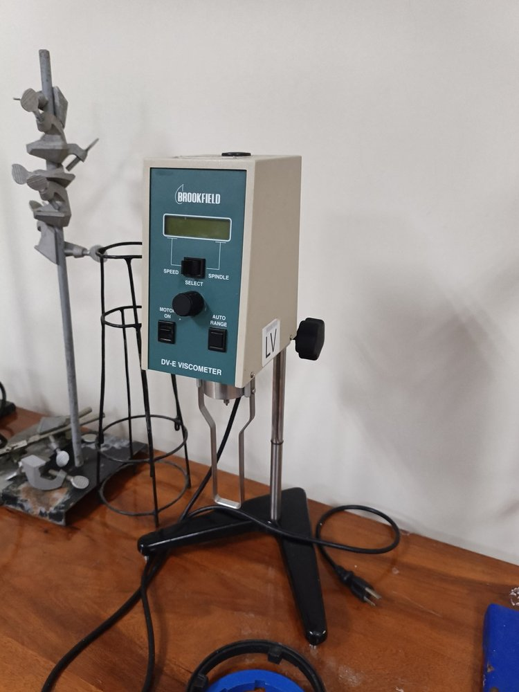

---

## Anexo: Materiales Complementarios de Laboratorio

### A1. Tubos de Digestión Kjeldahl en Gradilla Metálica
- **Material**: Vidrio borosilicato 3.3 de pared gruesa en soporte de acero inoxidable
- **Función**: Contenedores analíticos para soportar la digestión ácida a 420°C y acople directo en la unidad de destilación.

---

### A2. Cilindro de Gas con Manómetro Regulador
- **Material**: Cilindro de acero de alta presión con reductor de doble escala
- **Función**: Suministro controlado de gases técnicos de alta pureza para equipos térmicos y combustión.

---

*Catálogo oficial del proyecto **Asistente Inteligente de Laboratorio con Visión Artificial y RAG** — Universidad Técnica Estatal de Quevedo (UTEQ 2026).*  
*Entrenamiento validado con YOLO11n sobre 26 clases de equipos de Bromatología.*
